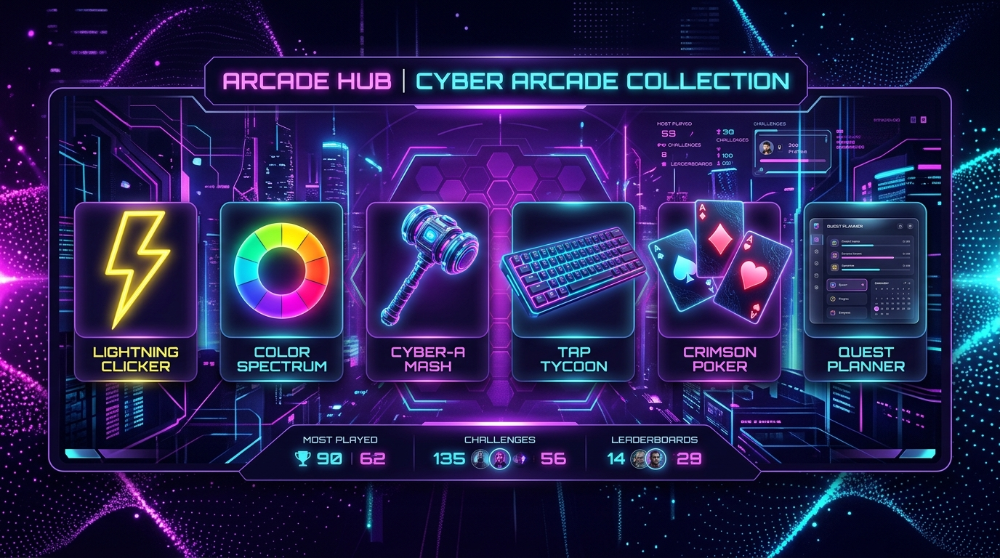

# 🕹️ Arcade Master Portal & Web Mini-Games Collection

[](https://arcade-master-portal.vercel.app)
[](https://developer.mozilla.org/en-US/docs/Web/HTML)
[](https://developer.mozilla.org/en-US/docs/Web/CSS)
[](https://developer.mozilla.org/en-US/docs/Web/JavaScript)
[](https://developer.mozilla.org/en-US/docs/Web/API/Web_Audio_API)
[](LICENSE)

A collection of 6 responsive, feature-rich HTML5 & JavaScript mini-games and productivity tools featuring a unified dark glassmorphism design system, Web Audio API sound synthesis, local storage score tracking, and a centralized Arcade Hub launcher.

🌐 **Live Demo URL:** [https://arcade-master-portal.vercel.app](https://arcade-master-portal.vercel.app)

---

## 🌟 Master Arcade Portal (`index.html`)

The root [`index.html`](file:///c:/Users/Admin/Desktop/desktop/LTTD/Revision-Assignment-Projects/Games/index.html) serves as the main launcher dashboard for the entire suite. Features include:
- **Interactive Search**: Real-time filtering by game name or keywords.
- **Category Tags**: Quick filtering by *Reflex & Speed*, *Memory & Color*, or *Productivity*.
- **Seamless Navigation**: One-click launch cards for every game with unified back-navigation banners inside each game.

---

## 🎮 Game Catalog & Features

### 1. ⚡ Click Speed Challenge (`GameWithJS/01-click-counter`)
- **Description**: Test finger speed and click frequency.
- **Features**:
  - Timer modes: **5s**, **10s**, and **30s** durations.
  - Real-time **CPS** (Clicks Per Second) gauge.
  - Integrated player name profile modal.
  - Personal high score tracking saved in `localStorage`.
  - Synthesized click pops, countdown beeps, and victory fanfare.

### 2. 🎨 Color Master Guessing (`GameWithJS/02-color-guessing-game`)
- **Description**: Train color perception by matching generated color codes to visual tiles.
- **Features**:
  - Multiple color formats: **RGB** (`rgb(255, 99, 71)`) and **HEX** (`#FF6347`).
  - Difficulty modes: **Easy (3 tiles)**, **Medium (6 tiles)**, **Hard (9 tiles)**.
  - Active win streak counter & record saving.
  - Interactive audio feedback on correct/incorrect picks.

### 3. 🔨 Cyber Whack-a-Mole (`GameWithJS/03-whack-a-mole`)
- **Description**: Fast-paced arcade reflex game with 3D-styled mole holes.
- **Features**:
  - Multi-type mole system:
    - 🐹 **Normal Mole**: +10 Points
    - ⭐ **Golden Mole**: +25 Points
    - 💣 **Explosive Bomb**: -15 Points
  - Difficulty speed selector (Easy, Medium, Hard).
  - Custom hammer cursor and pop/whack sound synthesis.

### 4. ⌨️ CyberTypist Speed Test (`GameWithJS/04-typing-speed-test`)
- **Description**: Cyberpunk typing test for testing WPM and precision accuracy.
- **Features**:
  - Real-time **WPM**, **Net WPM**, and **Accuracy %** calculations.
  - Dynamic passage categories: **Quotes**, **Code Snippets**, and **Tech Trivia**.
  - Cyberpunk glowing neon text stream with correct/error character highlighting.
  - Keypress tone audio synthesis.

### 5. 🃏 Memory Flip Card Master (`GameWithJS/05-memory-flip-game`)
- **Description**: 3D card flipping memory match game.
- **Features**:
  - Theme card decks: 🍕 **Food**, 💻 **Tech**, 🦁 **Animals**.
  - Board-locking mechanism during card mismatches to prevent click glitches.
  - Move counter, time limit countdown, and best score persistence.
  - 3D CSS card flip animations and match chime audio.

### 6. 📑 TaskMaster Planner (`GameWithJS/06-todo-list`)
- **Description**: Modern task planner and productivity dashboard.
- **Features**:
  - Priority tagging: 🔥 **High**, ⚡ **Medium**, 🌿 **Low**.
  - Status tabs (**All**, **Active**, **Completed**) and live search bar.
  - Quick action buttons to clear completed or wipe all tasks.
  - Complete data persistence using `localStorage`.

---

## 📁 Repository Structure

```text
Games/
├── arcade_banner.jpg           # Arcade Preview Header Image
├── index.html                  # Master Arcade Portal & Launcher Dashboard
├── vercel.json                 # Vercel Deployment Routing Config
├── README.md                   # Repository Documentation
└── GameWithJS/
    ├── 01-click-counter/       # Click Speed Test Game
    │   ├── index.html
    │   ├── style.css
    │   └── script.js
    ├── 02-color-guessing-game/ # RGB & HEX Color Guessing Game
    │   ├── index.html
    │   ├── style.css
    │   └── script.js
    ├── 03-whack-a-mole/        # 3D Cyber Whack-a-Mole Game
    │   ├── index.html
    │   ├── style.css
    │   └── script.js
    ├── 04-typing-speed-test/   # CyberTypist Speed Test
    │   ├── index.html
    │   ├── style.css
    │   └── script.js
    ├── 05-memory-flip-game/    # Memory Flip Card Game
    │   ├── index.html
    │   ├── style.css
    │   └── script.js
    └── 06-todo-list/           # TaskMaster Productivity Planner
        ├── index.html
        ├── style.css
        └── script.js
```

---

## 🛠️ Technology Stack & Architecture

- **Markup & Structure**: HTML5 Semantic elements (`<nav>`, `<header>`, `<main>`, `<section>`).
- **Styling & Theme**: Pure Vanilla CSS3 with CSS variables, Glassmorphism (`backdrop-filter: blur()`), 3D Transforms (`preserve-3d`), Flexbox, and CSS Grid.
- **Typography**: Google Fonts ([`Outfit`](https://fonts.google.com/specimen/Outfit) & [`JetBrains Mono`](https://fonts.google.com/specimen/JetBrains+Mono)).
- **Logic & State**: Modular Vanilla JavaScript (ES6+).
- **Audio Engine**: Custom **Web Audio API** Sound Synthesizer class integrated into every game (zero external audio file assets required).
- **Persistence**: Browser `localStorage` for high scores, win streaks, and task lists.

---

## 🚀 Deployment & Running Locally

### Live Deployment
Access the production application live on Vercel:
👉 **[https://arcade-master-portal.vercel.app](https://arcade-master-portal.vercel.app)**

### Local Setup
1. Clone or download this repository:
   ```bash
   git clone https://github.com/Kumar-Aditya-DEV/Revision-Assignment-Projects.git
   ```
2. Open [`index.html`](file:///c:/Users/Admin/Desktop/desktop/LTTD/Revision-Assignment-Projects/Games/index.html) in any modern web browser or run using VS Code Live Server.

---

## 📜 License

Distributed under the MIT License. Feel free to use, modify, and build upon this project!
